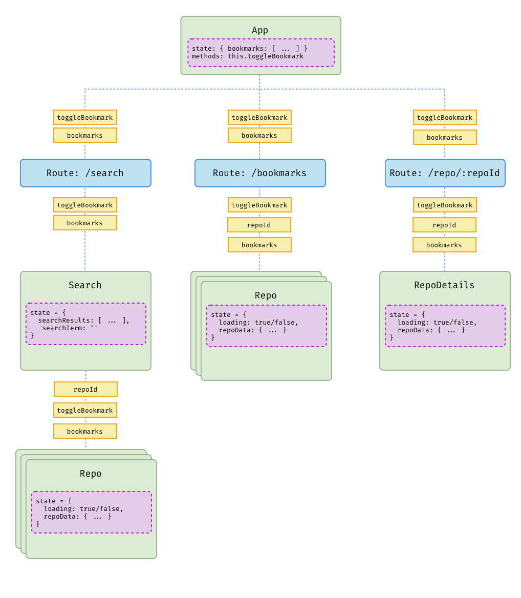
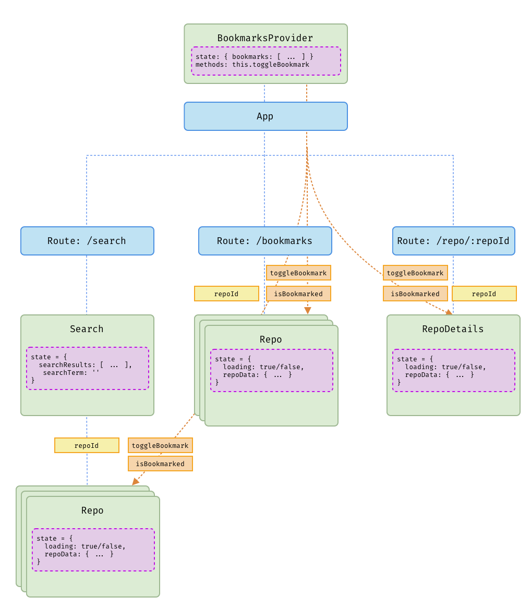

# Context Exercise

In this exercise, we will lift our bookmarking data & functionality to the top of our app.

Right now, a (simplified) view of our app looks like:



By the end of this exercise, we will have added a top-level `BookmarksProvider` that passes information down to the `Repo` and `RepoDetails` components. It will look something like this:




## ✅ Step 1: Create a Provider

- Create a new file, `./src/providers/BookmarkContext.js`
- Using the [Codesandbox solution](https://codesandbox.io/s/context-demo-solution-j7h81) as a template, create a new Provider component.
 - Rename the created context to `BookmarkContext`
 - Name the exports `BookmarkProvider` and `BookmarkConsumer`:
   ```js
   export const BookmarkConsumer = BookmarkContext.Consumer
   
   export class BookmarkProvider extends React.Component {
    /* ... */
   }
   ``
 - Remove the existing state & method from the demo.
 - In the render method, comment out the `value`, and rename the provider to `BookmarkContext.Provider`.

Your component should now simply render its children wrapped in the Provider created by React.

In App.js:

- Import the `{ BookmarkProvider }` and wrap the main App component with it (the same way that we wrap it with `<BrowserRouter>`. It doesn't matter if it's above or below the router.)

Check your app in the browser - you should see everything render and work as before.

## ✅ Step 2: Move bookmarking to the Provider

 - Copy the `state` and `toggleBookmark` method from App.js into the new BookmarksProvider. (Leave them on App.js for right now, we will remove them later)
 - Update the render method to provide a `value` to the `BookmarkContext.Provider` that includes the `bookmarks` state and `toggleBookmark` method
 - Add a temporary `test` property to the value. We'll use this in the next step to make sure the consumers are getting the right context values.
 
When you are complete, your component should look like this:

```js
/*  Be sure to import our helper functions as well, at the top of the file */
import { arrayIncludes, addToArray, removeFromArray } from '../utils'


export class BookmarkProvider extends React.Component {
 state = {
   bookmarks: [10270250, 29028775],
 }

 toggleBookmark = (id) => {
   /* same as pasted in from App.js */
 }

 render() {
   const value = {
     bookmarks: this.state.bookmarks,
     toggleBookmark: this.toggleBookmark,
     test: ':)'
   };
   return (
     <BookmarkContext.Provider value={value}>
       {this.props.children}
     </BookmarkContext.Provider>
   );
 }
}
```

## ✅ Step 3: Implement a Consumer


- In Repo.js, import the `{ BookmarkConsumer }`
- Create a new function component called `RepoWrapper`. Use it to wrap the `<Repo>` component within the Bookmark Consumer:

```js
import { BookmarkConsumer } from '../providers/BookmarkContext'

/* all of the existing code .... */

function RepoWrapper(props) {
  return (
    <BookmarkConsumer>
      {(bookmarkProps) => {
        return <Repo {...props} {...bookmarkProps}/>  
      }}
    </BookmarkConsumer>
  )
}
```

- Change the default export to `export default RepoWrapper`
- Add a `console.log(this.props)` within the render method of the `Repo` component.

Back in the browser, check the console - you should see that our `test` prop is now present.

## ✅ Step 4: Refactor Repo

Ok, now we have the `bookmarkRepo` function in our props. But, we are still relying on parent components to determine wether or not this repo is bookmarked or not. This shouldn't really be the responsibility of the parent components - really, it's just a concern for the component itself.

We can do this in one of two ways:

 1. Look at the `bookmarks` prop that is passed in by the context, and use our `arrayIncludes` helper to see if it contains the `repoId`.
 2. Handle all of this in the `BookmarksProvider` component, and supply a simple `isBookmarked` method to the consumers.

We'll do the latter.

Back in BookmarkContext.js:

 - Add a new method called `isBookmarked`:

 ```js
  isBookmarked = (repoId) => {
    return arrayIncludes(this.state.bookmarks, repoId)
  }
 ```

 - In the render method, add `isBookmarked` to the `value` in the same manner as `toggleBookmark`

In Repo.js:

 - So far, we have been relying on the `bookmarked` prop - but now, we'll use the new `isBookmarked` utility instead. In the render method, remove the line that gets `bookmarked` out of the props, and replace it with:

 ```js
 const { isBookmarked, repoId } = this.props
 const bookmarked = isBookmarked(repoId)
 ```

In your browser, navigate to the `/bookmarks` route. The button for each repo should read 'remove bookmark', and clicking on it should toggle it to 'add bookmark'.

🤔 But wait, shouldn't the bookmark disappear from the list when we remove it?

Yes, it should! But if you look at `App.js`, you'll see that it's still rendering out a list of bookmarks from its own state. 

## ✅ Step 5: Refactor App

Back in App.js:

 - Remove the `state` and `toggleBookmark` method (This will break your app! don't worry)
 - Remove the props passed to `Bookmarks` and `Search`. Those routes should now look like:

 ```js
 
  <Route
    path="/bookmarks"
    render={() => {
      return <Bookmarks />
    }}
  />
  <Route
    path="/search"
    render={() => {
      return <Search />
    }}
  />
 ```
🤯 This will break your app! Don't worry. `Bookmarks` and `Search` still rely on some props being passed in. We'll fix this up in the next step:

## ✅ Step 6: Refactor Bookmarks, and Search

Now, in Bookmarks.js:

 - Remove the `toggleBookmark` and `bookmarked` props that are passed to `<Repo />` - We have already set up the Repo component to get these props from the Context.
 - Import `BookmarkConsumer` at the top of the file. Use it to either:
 
 - Create a wrapper component like we did in Repo, and export the wrapper as the default - or update the existing Bookmarks component to include the context provider (examples below).
	 - Note: Either of these ways will work. Pick the one that makes the most sense to you:

**Option 1:** Wrap the elements rendered by Bookmarks **INSIDE** the Bookmarks component:

  ```js
function Bookmarks() {
  return (
    <BookmarkConsumer>
      {(bookmarkProps) => {
        return (
          <div className="resultsList">
            <h2>Your Bookmarks</h2>
            {bookmarkProps.bookmarks.map((repoId) => {
              return <Repo key={repoId} repoId={repoId} />
            })}
          </div>
        )
      }}
    </BookmarkConsumer>
  )
}
  ```
  
or
  
**Option 2 (recommended):** Create a wrapper that exports your Bookmarks component so you can leave your Bookmarks component alone and still inject context into it:

  ```js
function Bookmarks(props) {
  return (
    <div className="resultsList">
      <h2>Your Bookmarks</h2>
      {props.bookmarks.map((repoId) => {
        return <Repo key={repoId} repoId={repoId} />
      })}
    </div>
  )
}

function BookmarksWrapper(props) {
  return <BookmarkConsumer>{(bookmarkProps) => <Bookmarks {...props} {...bookmarkProps} />}</BookmarkConsumer>
}

export default BookmarksWrapper

  ```


Finally, in Search.js:

This component was using the `bookmarks` prop to see if a repo was bookmarked, and then passing in the `toggleBookmark` prop. Since `<Repo>` is now handing this on its own, we can:

 - Remove the line `const { bookmarks, toggleBookmark } = this.props` from the render method
 - Remove the `toggleBookmark` and `bookmarked` props that are passed to `<Repo />`
 - Remove the `const isBookmarked = arrayIncludes(bookmarks, repo.id)` line

Now, back in the browser:

 - Navigate to the `/search` route
 - Do a search for 'react'

You should see a list of components - the official `react` repo should already be bookmarked. Try toggling a bookmark, adding other ones, and navigating to the `/bookmarks` route to see if everything is working as it was before.

That's it! In the next lesson, we will use Context to put all of our Github API functionality in one place


