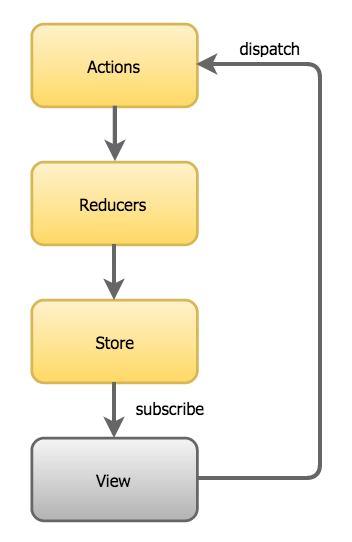

# Intro to Redux

**By Ira Herman**

Let's get Redux up and running in your app quickly.

## Learning Objectives

- Understand Redux Store, Actions, and Reducers
- Add Redux to a project to use as a global store for state management

## Intro

Redux is pretty easy to use once you understand how it works and get used to it. At first though, these concepts will seem very different. Let's talk about how the major pieces work, then it will start to make more sense as we implement redux in our app.

Key components we'll be working with:


- **Store**: Where the global state lives
- **Reducers**: Reducers take in a command (**action**) and spit out a modified/updated state. We write a switch case in here to match all the possible events (actions) that can be handled.
- **Actions**: In order to handle events, we **dispatch** actions (and values) to our store. It will match to a switch case in our reducer, update the state, and return a new state.

Any components that **Subscribe** to a store will update and re-render any time the global state is updated.




Redux can be used with anything you want to manage global state with (not just react), but it works especially well with React.

## Let's use redux in our project:

We'll start with our [counter app](https://codesandbox.io/s/counter-usestate-13luz), but you can use these same steps for any project. 

Here's what we'll do to update counter app:

- Pull the Counter component out of the `index.js` into a separate `Counter.js` file.
- Add and use redux to manage global state:
	- Install redux packages
	- Create a reducer
	- Add redux imports
	- Create a `store`
	- Wrap your app in the redux Provider
	- Dispatch Actions
	- Subscribe a component to updates with `connect`

🔗[Solution code](https://codesandbox.io/s/counter-redux-6hnfs)

Let's jump in!

### Add the redux and react-redux packages to your project

`npm install redux --save`

and

`npm install react-redux --save`


### Create a reducer

You can have more than one reducer in a redux project (although one will work just fine for our needs), so it's a good idea to create a `store` folder and create your `reducer.js` inside there.

In your `store/reducer.js` add the following code:

```js
////////// Redux Store ////////////

const initialState = {
  count: 0,
  name: "Abdul"
};

// Function to accept state and actions. Default
// param used is initialState if one is not specified:
const reducer = (state = initialState, action) => {
  switch (action.type) {
    case "UPDATE_NAME":
      return {
        ...state,
        name: action.value
      };
    case "INCREMENT_COUNT":
      return {
        ...state,
        count: state.count + 1
      };
    case "DECREMENT_COUNT":
      return {
        ...state,
        count: state.count - 1
      };
    default:
      return state;
  }
};

export default reducer;
```

Notice we don't need to import redux here, we'll do that from our index.js and import this file into it.

### Add redux imports to `index.js`

At the top of our `index.js` add the following lines right below `import React from "react";` and `import ReactDOM from "react-dom";`

```js
import { createStore } from "redux";
import { Provider } from "react-redux";
import reducer from "./store/reducer";
```

### Create our `store`

Next in our `index.js` let's create our global store so we can use it throughout our app for a global state.

Below the imports (but above the rest of the app and components), add the following line:

```js
// Create a redux store using the reducer function from above.
const store = createStore(reducer);
```

**NOTE: Redux has a GREAT devtools chrome extenstion. If you want to use it, you need to pass a second argument to `createStore`.**

To use the redux devtools extension, create state with **this** code instead:

```js
// Create a redux store using the reducer function from above.
// Optional second argument enables redux devtools chrome extension:
const store = createStore(
  reducer,
  window.__REDUX_DEVTOOLS_EXTENSION__ && window.__REDUX_DEVTOOLS_EXTENSION__()
);
```

Once that's done, we can check our state (initialized in our reducer) like this:

```js
console.log("Current State:", store.getState());
```

### Wrap your app in the Redux Provider

Now in order to use that store throughout our entire React app, let's wrap our <App /> component in the redux provider. The easiest way to do it is this:

Where we have this:

```js
ReactDOM.render(<App />, rootElement);
```

Change it to:

```js
ReactDOM.render(
  <Provider store={store}>
    <App />
  </Provider>,
  rootElement
);
```

### Dispatch actions

To update our state (so subscribing components receive a new one), we dispatch actions to our store. It looks like this:

```js
///////////////////////////////////
// store.dispatch({
//   type: "UPDATE_NAME",
//   value: "Ira"
// });
```

The dispatch hits the switch case in our reducer and matches the `"UPDATE_NAME"` case.

The logic in our `"UPDATE_NAME"` case returns a new state that overwrite the `name` property with the new `value` in our dispatched action.

```js 
case "UPDATE_NAME":
      return {
        ...state,
        name: action.value
      };      
```

Let's update our `counter.js` with the following code:

```js
import React from "react";
import { connect } from "react-redux";

////////// Counter Component ////////////
const Counter = props => {
  const { name, count, increment, decrement, handleGreetingClick } = props;

  return (
    <div>
      <h1 onClick={handleGreetingClick}>Hello {name}!</h1>
      <span>Current Count: {count}</span>
      <button onClick={decrement}>-</button>
      <button onClick={increment}>+</button>
    </div>
  );
};

// Map redux state values to props:
const mapStateToProps = state => {
  return {
    count: state.count,
    name: state.name
  };
};

// Dispatch actions/event handlers go here:
const mapDispatchToProps = dispatch => {
  return {
    increment: () => dispatch({ type: "INCREMENT_COUNT" }),
    decrement: () => dispatch({ type: "DECREMENT_COUNT" }),
    handleGreetingClick: () => {
      dispatch({
        type: "UPDATE_NAME",
        value: "Ira"
      });
    }
  };
};

// Adding second argument mapDispatchToProps is optional if
// we are not dispatching actions in this component:
export default connect(
  mapStateToProps,
  mapDispatchToProps
)(Counter);
```

Notice how in the `mapDispatchToProps` function...

```js
// Dispatch actions/event handlers go here:
const mapDispatchToProps = dispatch => {
  return {
    increment: () => dispatch({ type: "INCREMENT_COUNT" }),
    decrement: () => dispatch({ type: "DECREMENT_COUNT" }),
    handleGreetingClick: () => {
      dispatch({
        type: "UPDATE_NAME",
        value: "Ira"
      });
    }
  };
};
```

... we wire up handlers that dispatch actions to redux.

We also map **just the elements we need** from the redux global state to **props** in our component:

```js
// Map redux state values to props:
const mapStateToProps = state => {
  return {
    count: state.count,
    name: state.name
  };
};
```

now the `props.count` in our `Counter` component will contain our redux state `count`, and `props.name` will have our redux state `name`. We can add more if we need them.

### Subscribe a component to updates with `connect`

Now for the magic redux gives us to make this all work with our components! Any component we want to `subscribe` to global state updates we need to wrap in a special wrapper from react-redux called `connect`. 

**Here's how it works.**

First we import `connect`:

```js
import { connect } from "react-redux";
```

Then...

Instead of the usual export for our component:

```js
export default Counter;
```

Connect gives us a special wrapper (YAY! We don't have to write our own! 🎉🥳)!

We just `export default connect(<mapping args>)(Counter)` and as long as we pass our Counter Component in the second set of `()` redux will inject state updates into our component for us 😎.

Notice this at the bottom of our `Counter.js`:

```js
export default connect(
  mapStateToProps,
  mapDispatchToProps
)(Counter);
``` 

We can add these to any component that we want to use our global redux state.

## Next steps

- Play with this counter codepen and get a feel for adding actions, updating other values in state, etc.

- Add redux to **YOUR OWN** project (optional)